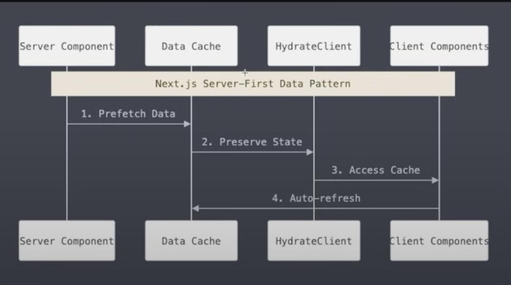
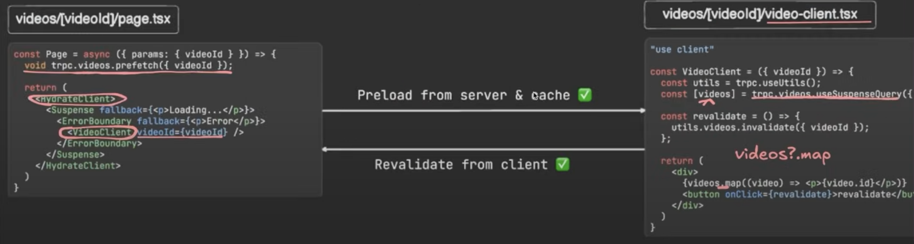
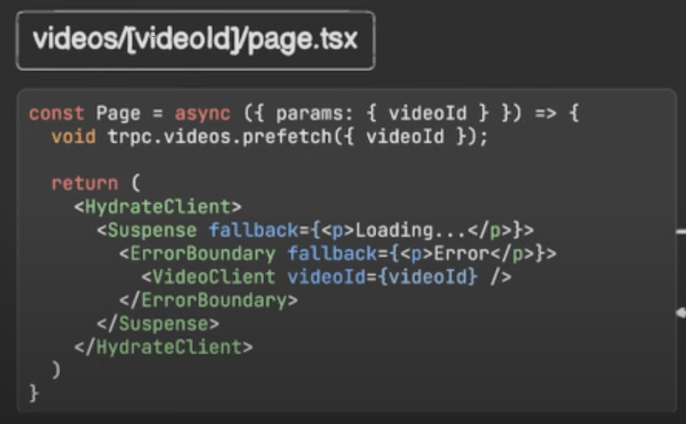
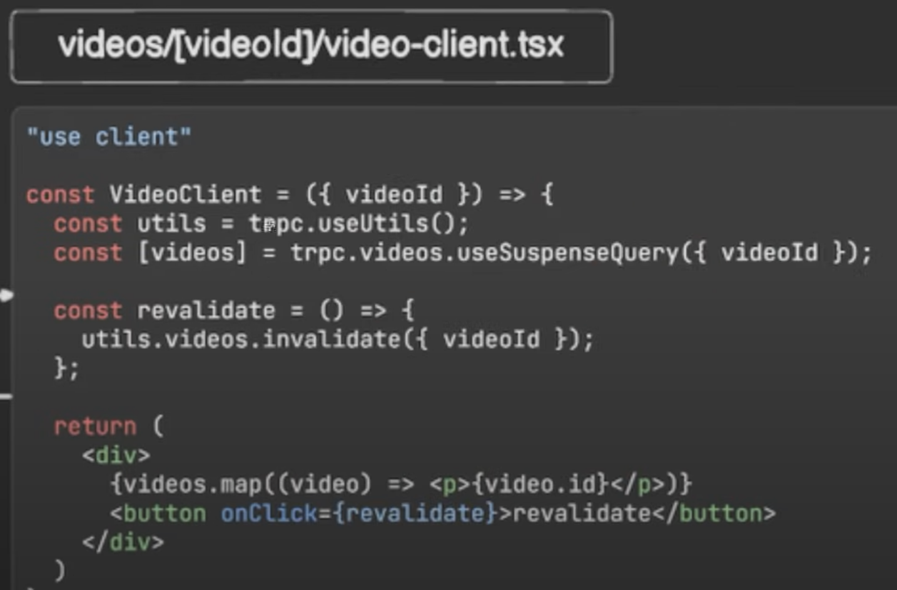

## Server-First Data Pattern in Next.js

### 🚀 Overview

The Server-First Data Pattern follows the "Render as you fetch" concept to improve page load performance by fetching data on the server before rendering the UI.

### ✅ Benefits:

- RSC as "loaders" for prefetching data
- Faster load times due to early data fetching
- Parallel data loading for better performance

### 🛠 Implementation Steps

1️⃣ Start with a Server Component

- Server Components in Next.js can fetch and prefetch both public and [authenticated data](./trpc-authenticated-prefetch.md)
- This eliminates the need for fetching inside Client Components, reducing network requests in the browser.
- We also integrate tRPC inside the Server Component.

2️⃣ Auto-Cache with tRPC + React Query

- tRPC tightly integrates with React Query, meaning the prefetched data will automatically be stored inside the React Query cache.
- This eliminates the need for redundant fetching on the client side.

3️⃣ Hydrate-Client Component for Cache & [Auto Refresh](./auto-refresh.md)

- The Hydrate-Client component ensures that prefetched server data is accessible to Client Components.
- It also enables auto-refreshing when necessary.

📌 Diagrams

